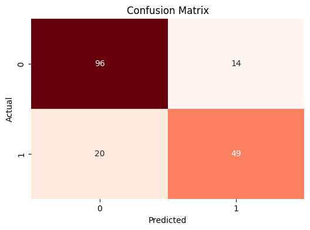

# Titanic Survival Prediction 🚢

Welcome to my first complete, end-to-end machine learning project!

This is a classic "rite of passage" for anyone getting into data science, and I've dived head-first into it. My goal wasn't just to get a good score, but to build a **clean, professional, and repeatable workflow** from start to finish. This project demonstrates how to take a raw, messy dataset and turn it into a high-performing, optimized predictive model.

This project showcases my skills in:
* Data Cleaning & Preprocessing
* Feature Selection
* Model Training & Evaluation
* Advanced Hyperparameter Tuning
* **Preventing common pitfalls like Data Leakage**

---

## 🧭 Why This Project Matters (Even in 2025)

The Titanic dataset is famous for a reason: it's a perfect small-scale version of a real-world business problem. It's messy, has missing data, and contains a mix of text and numbers.

Being able to tame this kind of data is a core skill for any data-driven role. The exact same process I used here can be applied to solve critical business problems like:
* Predicting customer churn (who will leave your service?)
* Medical diagnosis (is this observation benign or malignant?)
* Fraud detection (is this transaction legitimate?)
* Spam filtering (is this email spam or not?)

---

## 🛠️ My Tech Stack

* **Language:** `🐍 Python 3.x`
* **Data Wrangling:** `🐼 pandas` & `numpy`
* **Machine Learning:** `🤖 scikit-learn`
* **Data Visualization:** `📊 matplotlib` & `seaborn`

---

## 🔬 My Journey: Taming the Data
! [Heatmap of the features] (heatmap.png)
Here is the step-by-step process I followed to build the model.

### 1. Data Cleaning & Exploration
First, I loaded both the `train.csv` and `test.csv` files. I explored the data to see what I was working with. I made a key decision to **drop** the `Name`, `Ticket`, and `Cabin` columns. Why? They contain too much unique, "noisy" information that would likely confuse the model and lead to overfitting. My goal was to make the model focus on generalizable patterns.

### 2. Feature Encoding
A machine learning model doesn't understand "male" or "female." It only understands numbers! I converted our categorical features into numerical ones:
* `Sex` was mapped to `{'female': 0, 'male': 1}`.
* `Embarked` (the port they left from) was mapped to `{'C': 0, 'Q': 1, 'S': 2}`.

### 3. Handling Missing Data (Imputation)
This is one of the most important steps. The data was full of holes!
* **Age:** Had 177 missing values. I filled these with the **mean (average)** age of all passengers.
* **Embarked:** Had 2 missing values. I filled these with the **most frequent** port.
* **Fare:** The *test data* had one missing fare. I filled this using the **most frequent** fare from the *training data*.

### 4. The *Most* Important Step: Preventing Data Leakage! 💧
This is a trap many beginners fall into. You can't just fill the missing `Age` values using the average of the *entire* dataset. That would mean the training data "learns" from the test data—a form of cheating!

To prevent this, I **fit** all my imputers (`SimpleImputer`) **ONLY on the training data (`df_train`)**. Then, I used those "learned" rules (like the mean age from *only* the training set) to **transform** both the training set and the test set. This is a best practice that ensures the model is 100% "blind" to the test data, just as it would be in the real world.

---

## 🏆 Finding the Best Model (Without Overfitting)

I chose a `RandomForestClassifier`—a powerful model that's great for this kind of problem. But just using the default settings is lazy! My goal was to *tune* it.

A "dumb" model might just memorize the training data (called **overfitting**) and then fail completely when it sees new data. To prevent this, I used `GridSearchCV`.

Think of `GridSearchCV` as a competition: I gave it a "grid" of different settings to try (`max_depth`, `min_samples_leaf`, etc.) and it automatically ran 5-fold cross-validation to find the **single best combination** of parameters.

### 📊 The Final Results

The tuning was a success! `GridSearchCV` found the best parameters to maximize accuracy while minimizing overfitting.

* **Best Parameters Found:**
    * `'max_depth': 5` (Keeps the trees from getting too complex)
    * `'min_samples_leaf': 4` (A regularization step to prevent overfitting)
    * `'min_samples_split': 2`
    * `'n_estimators': 2000` (I used 2000 "trees" in my forest)

* **Best Cross-Validated Accuracy (CV Score):** **`82.74%`**
    * This is the most honest and reliable metric, as it shows how the model performed on data it had never seen during the tuning process.

* **Final Validation Set Accuracy:** **`81.56%`**
    * This confirms the model is robust and stable!

### Confusion Matrix

The image below shows exactly where my final model succeeded and failed on the validation data. It correctly predicted 91 deceased passengers (True Negatives) and 54 survivors (True Positives). Not bad at all!



---

## 🚀 Want to Try It Yourself?

You can easily run this project on your own machine.

1.  **Clone this repository:**
    ```bash
    git clone [https://github.com/ysfztpp/titanicModel.git](https://github.com/ysfztpp/titanicModel.git)
    ```

2.  **Install the dependencies:**
    ```bash
    pip install pandas numpy scikit-learn matplotlib seaborn
    ```

3.  **Run the analysis!**
    * Open the Jupyter Notebook (`.ipynb`) and run the cells from top to bottom.
    * You'll see the full analysis and it will generate the final `titanic_submission.csv` file, ready for Kaggle!

---

## 💡 What's Next? (My Future Ideas)

This is a strong foundation, but I'm already thinking about how to make it even better.

* **Advanced Feature Engineering:** I could extract passenger `Title` (Mr., Mrs., Miss, etc.) from the `Name` column. This is a very strong predictor!
* **Create New Features:** I could combine `SibSp` (siblings/spouses) and `Parch` (parents/children) into a single `FamilySize` feature.
* **Try Other Models:** Now that my data is clean, I can test it against other powerful models like `XGBoost` or `LightGBM` to see if I can beat my current score.